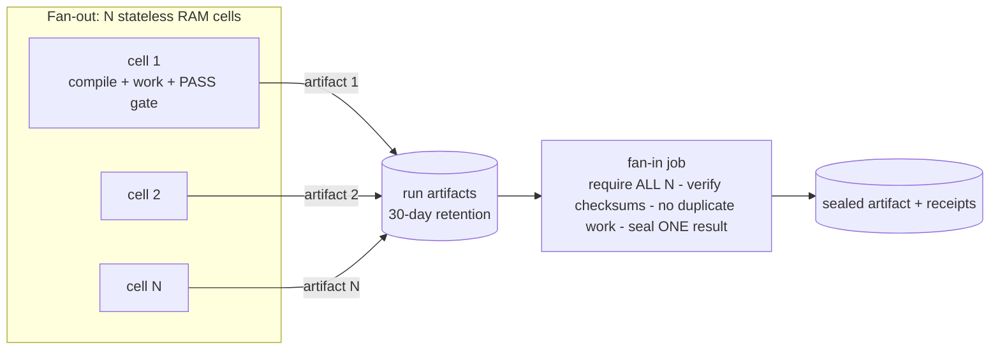

# GitRAM

**GitRAM = GitHub Actions containers used as stateless RAM/compute for Asolaria.**

A GitRAM lane fans a job out across N isolated GitHub-hosted containers (each one a
"RAM cell"), lets every cell do one complete, self-contained unit of work, persists each
cell's result as a run artifact, and then runs one **fan-in** job that requires *all* N
checkpoints, verifies them, and seals a single result — without ever sharing mutable
state between cells and without overwriting any local (RELIC / LIRIS / ACER) lane.

> "The RELIC and Liris local trainers remain live, but local memory and CPU serialize
> too much of the floor. GitRAM adds stateless GitHub container capacity without sharing
> mutable model state or overwriting either local lane."
> — origin PR (HYPER-BECHS--the-third-set #42, LIRIS seat, 2026-07-15)

## Instructions — how to run a GitRAM lane

1. **Copy the template.** Take [`templates/gitram-template.yml`](templates/gitram-template.yml)
   into `.github/workflows/` of the repo that owns the work.
2. **Make each cell self-contained.** A cell must `checkout`, compile its tool **from
   source in-repo** (the origin lane uses a single dependency-free `rustc` compile), do
   exactly one unit of work, and prove it with a PASS marker grepped from its own log
   (origin gate: `GITRAM_SHARD_PASS`). No cell may read another cell's state.
3. **Upload one artifact per cell** with `if: always()`, `if-no-files-found: error`, and
   explicit retention. The artifact must contain everything the fan-in needs to resume —
   checkpoint, metadata (`CUBE-META.hbp` in the origin lane), and the cell log.
4. **Fan-in requires ALL cells.** `needs: <cell-job>` + `if: always()`, download with a
   pattern + `merge-multiple: true`, then **count the checkpoints and fail unless the
   count equals N**. Verify `sha256sum -c` over everything. Resume/seal in one worker.
   The fan-in performs **no duplicate work** — it verifies and seals only.
5. **Gate every claim on the owning check.** The run is green only when the actual
   GitHub check concludes `success` — a passing local run, a log excerpt, or a PR body
   claim is SCOPED evidence, not a green. Tag results `MEASURED` / `CANON` / `UNVERIFIED`.
6. **Size the fan-in.** The fan-in is the long pole: it walks all N checkpoints
   sequentially. Budget `timeout-minutes` for ~N × per-cell verify time, or shard the
   fan-in itself. Set `concurrency.cancel-in-progress: false` so a new push cannot kill
   a seal in flight.
7. **A cancelled fan-in is resumable.** Cell artifacts persist for the retention window,
   so if the fan-in dies or is cancelled, use **Re-run failed jobs** on the same run —
   only the fan-in re-executes; the cells are never retrained.

## First deployment (MEASURED)

The first GitRAM lane ran on 2026-07-15 in
[HYPER-BECHS--the-third-set PR #42](https://github.com/JesseBrown1980/HYPER-BECHS--the-third-set/pull/42)
(branch `agent/liris-pais-gitram-floor1-20260715`, LIRIS seat): 27 containers each
trained one balanced all-byte Pais cube through 8 reversible representations × 10
predictor functions × 10 persistent epochs = 800 measured cells per cube.

Run `29415341620`: **27/27 cube jobs succeeded** (~1.5–3.5 min each), **27/27 artifacts
uploaded**, receipt-integrity green. The fan-in ("Verify 27 checkpoints and seal
floor-one Omega") was **cancelled** (SIGTERM, exit 143) 23 minutes in, after verifying
cubes 01–14 of 27 — not a timeout (its limit was 60 min) and not a concurrency cancel
(`cancel-in-progress: false`). **The floor-one Omega is therefore NOT yet sealed**; the
27 checkpoints remain in artifacts and the seal is one fan-in re-run away.
Full receipt: [`docs/FIRST-DEPLOYMENT-PR42.md`](docs/FIRST-DEPLOYMENT-PR42.md).

## Boundaries (held, by design)

- One floor only — higher floors are **HELD** until operator-gated.
- Density means measured structure/repetition only.
- No compression-record, patent-physics, or live-promotion claims ride on a GitRAM run.
- Fan-in requires all N self-contained checkpoints and performs no duplicate training.
- GitRAM is **independent of local lanes** — it never mutates RELIC/LIRIS/ACER state.

## Repository layout

| Path | What it is |
| --- | --- |
| `templates/gitram-template.yml` | Reusable GitRAM workflow (N cells + fan-in), modeled 1:1 on the origin lane |
| `docs/GITRAM-DOCTRINE.md` | The GitRAM doctrine, from the origin PR |
| `docs/FIRST-DEPLOYMENT-PR42.md` | Measured receipt of the first deployment |
| `receipts/GITRAM-GENESIS-20260715.hbp` | Hot-path HBP tuple rows (`json=0`) for this repo's genesis + `.sha256` sidecar |

---

*Asolaria federation · owner OP-JESSE · GitRAM concept first deployed by the LIRIS seat
(PR #42); this instruction repo assembled by seat ACER-CLAUDE-FABLE5.*
